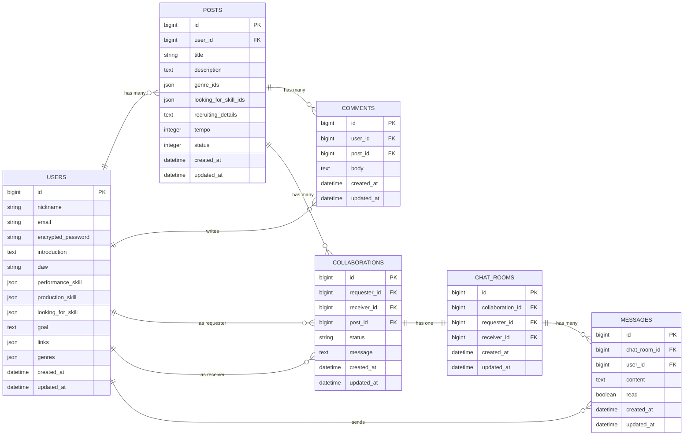

## アプリケーション名
### CollabTune
<p align="center">
  
</p>

##  アプリ概要
DTMer（デスクトップミュージシャン）同士が、気軽に音源を投稿・共有し、  コメントやコラボ申請を通して曲作りでつながることができるWebアプリ。  
目的は「音楽制作を通じた孤独の解消」と「創作の協働化」。  
個人制作が中心になるDTMでは、他者からのフィードバックや仲間探しが難しく、孤独を感じやすいという課題があります。
また、コラボ相手を探す手段も限られており、作品を共同で作るハードルが高い状況を改善するために開発しました。


## 対象ユーザー
- 自宅で一人でDTM制作しているアマチュアミュージシャン  
- 楽器は得意だがボーカルやMIXなど他分野の協力者を探している人  
- コラボのきっかけが欲しい人  


## URL
https://collab-tune.onrender.com/


## テスト用アカウント
- Basic認証ID: admin
- Basic認証パスワード : 3333
- メールアドレス : test@test
- パスワード : 1k1k1k


## 利用方法
### 自分の音源を投稿したい人向け
---
1. 新規登録・ログイン後、ヘッダーの「新規投稿」から音源（MP3）をアップします。  
2. タイトル・説明・ジャンル・テンポを入力して投稿すると一覧に表示されます。  
3. コラボを募集したい場合は説明文に募集内容を記載します。  
4. 他ユーザーからのコラボ申請を「承認／拒否」できます。  
5. 承認後は自動生成された1対1チャットルームでリアルタイムにやり取りできます。  
### 人の投稿を見てコラボ相手を探したい人向け
---
1. トップページで音源を視聴し、気になる投稿の詳細を確認します。  
2. コメントでやり取りしたり、説明欄を見てコラボ募集状況を確認できます。  
3. 「コラボ申請」ボタンからメッセージ付きで依頼を送れます。  
4. 承認されると1対1チャットが自動生成され、リアルタイムで打ち合わせできます。  
5. 「募集中のみ」フィルタでコラボ募集の投稿だけに絞り込めます。 


## アプリケーションを作成した背景
DTM はアマチュアほど「作曲・編曲・録音・MIX まで全部一人でやる」ことが多く、プロの現場が分業で成り立っているのに対し、大きなギャップがあります。私自身も制作の中で孤独を感じたり、得意分野が違う仲間と気軽に組めないことに課題を感じていました。

そこで、音源投稿からコラボ申請、そして1対1チャットでのやり取りまで一つに繋がる仕組みを作ることで、アマチュアでも自然に“分業的に協力し合える場”を作りたいと思い、このアプリを開発しました。


## 機能一覧

| No | 機能名           | 概要                   | 対応モデル                        | 備考                                        |
| -- | ------------- | -------------------- | ---------------------------- | ----------------------------------------- |
| 1  | ユーザー登録 / ログイン | Deviseによる認証機能        | User                         | プロフィール編集（アイコン・紹介文・スキル等）対応                 |
| 2  | 投稿作成          | 音源・タイトル・説明・ジャンルなどを登録 | Post                         | S3保存、genre_ids / looking_for_skill_ids 対応 |
| 3  | 投稿編集 / 削除     | 投稿者本人のみ編集・削除が可能      | Post                         | 権限チェックあり                                  |
| 4  | 投稿一覧          | 全投稿をカード形式で一覧表示       | Post                         | 音源再生、ユーザー別一覧（マイページ）あり                     |
| 5  | 投稿検索          | タイトル・説明文を部分一致で検索     | Post                         | ヘッダーの検索フォームから実行                           |
| 6  | 投稿絞り込み        | 「募集中のみ」の表示切替         | Post                         | enum status: recruiting/closed            |
| 7  | 投稿詳細          | 音源再生・詳細表示・コメント・コラボ申請 | Post, Comment, Collaboration | コメントは同期処理                                 |
| 8  | コメント機能        | 投稿にコメントを追加・表示        | Comment                      | Turbo未使用（同期）                              |
| 9  | コラボ機能         | コラボ申請／承認／拒否          | Collaboration                | 承認時にチャットルーム自動生成                           |
| 10 | チャット機能        | コラボ成立後の1対1チャット       | ChatRoom, Message            | AJAX + Pollingによるメッセージ送受信／既読処理・未読バッジ対応         |


## 実装予定の機能
- **いいね機能**  
  投稿に対してリアクションできる仕組み。人気投稿の可視化を目指す。

- **絞り込み機能の拡張**  
  ジャンル・得意パート・募集スキルなどでもフィルタリングできる検索UIを追加予定。

- **通知機能の拡張**  
  コメント・コラボ申請の状況変化などをリアルタイム通知し、クリックでモーダル表示→詳細画面へ遷移可能にする。

- **複数人チャット機能**  
  1対1チャットから、複数ユーザー参加型の共同制作向けチャットルームへ拡張。


## 実装した機能についてのGIFおよび説明


### ① 投稿一覧 & 音源プレビュー  
<p align="center">
  <br><br>
  投稿がカード形式で一覧表示され、再生ボタンを押すだけでその場で音源を試聴できます。<br>
  独自実装の AudioPlayer により、ページ遷移なしで楽曲の雰囲気をすぐ確認できます。
</p>

---

### ② 投稿詳細 & コラボ申請  
<p align="center">
  <br><br>
  投稿詳細画面ではコメント投稿や、メッセージ付きコラボ申請が行えます。<br>
  確認から申請までが1ページで完結する導線を意識しています。
</p>

---

### ③ コラボ承認 → チャット自動生成  
<p align="center">
  <br><br>
  コラボ申請が承認されると、自動で1対1チャットルームが生成されます。<br>
  未読バッジによって視認性も高く、制作の連携や打ち合わせがスムーズに行えます。
</p>

---

### ④ プロフィール編集  
<p align="center">
  <br><br>
  DAW・得意スキル・募集スキル・ジャンル・SNSリンクなどを設定できます。<br>
  JSON形式で柔軟に管理され、ユーザーの強みが一目で伝わる仕様です。
</p>

## ER図

## 画面遷移図
```mermaid
graph TD

  %% トップ
  A[トップページ<br>投稿一覧] 
  A --> B[新規登録]
  A --> C[ログイン]
  A --> D[投稿詳細]
  A --> E[新規投稿]
  A --> U[ユーザーマイページ<br>投稿一覧]
  A --> Q[プロフィール表示]
  A --> H[コラボ一覧<br>（送信・受信）]

  %% 投稿詳細からの遷移
  D --> F[コメント投稿（同ページ内）]
  D --> G[コラボ申請（同ページ内）]

  %% 認証後の遷移
  B --> A
  C --> A

  %% 投稿関連
  E --> A
  D --> P[投稿編集]
  P --> A

  %% コラボ関連
  H --> D
  H --> T[チャットルーム]

  %% プロフィール（追加＆修正）
  U --> Q
  Q --> U
  Q --> R[プロフィール編集]
  R --> Q

  %% チャット関連
  A --> S[チャット一覧]
  S --> T

  ```

## 開発環境

| 分野      | 使用技術                                                              |
| ------- | ----------------------------------------------------------------- |
| フロントエンド | HTML / CSS / JavaScript / Turbo / Tailwind CSS（tailwindcss-rails） |
| バックエンド  | Ruby on Rails 7                                                   |
| 認証      | Devise                                                            |
| 非同期処理   | Turbo Streams / Turbo Frames                                      |
| ストレージ   | AWS S3（音源・プロフィール画像の保存）                                            |
| DB      | MySQL（開発） / PostgreSQL（本番）                                        |
| デプロイ    | Render（Webサービス / データベース）                                          |
| バージョン管理 | Git / GitHub                                                      |
| 開発エディタ  | VSCode                                                            |

## ローカルでの動作方法
以下のコマンドを順に実行してください。  
git clone https://github.com/kaito8958/collab_tune.git  
cd collab_tune  
bundle install  
rails db:create  
rails db:migrate  
rails s  


## 工夫したポイント
- **孤立しがちなDTMクリエイター同士をつなぐことを最優先に設計**  
  楽器・ボーカル・ミックスなど得意分野が異なるユーザーが互いに補完し合えるよう、  
  「コラボ申請」「チャット」「コラボ募集ステータス」などを一連の流れで使えるUXを意識しました。

- **音源プレビューを最適化し、投稿一覧でサクッと試聴できるUIを実装**  
  再生・一時停止を直感的に行えるよう、独自のAudioPlayerを実装し、  
  一覧ページでも曲の雰囲気がすぐ掴める構成にしています。

- **ユーザーごとの強みを最大限に表現できるプロフィール設計**  
  DAW、得意スキル、募集パート、ジャンル、SNSリンクなどをJSON形式で柔軟に管理し、  
  ミュージシャン同士が「誰と組むべきか」を判断しやすい構造にしました。

- **コラボ成立後に自動でチャットルームを生成する導線設計**  
  コラボ成立 → 1対1チャット生成 → 音源や進捗のやり取りへスムーズに遷移でき、  
  メッセージの未読バッジ表示などの仕組みも実装しています。

- **検索 + フィルタリングで欲しい投稿を最短で探せる機能**  
  タイトル・説明文全文検索に加えて、「募集中のみ」の絞り込み機能を搭載し、  
  作りたい作品に参加するユーザーが迷わず探せるUIを工夫しました。

- **Tailwind CSS を活用して、短期間でも統一感あるUIを構築**  
  カードレイアウトやグラデーション、モーダルなどをTailwindで効率的に作成し、  
  レスポンシブ対応も自然に行えるようにしました。


## 改善点
- コラボ完了後の作品を、参加メンバー全員のクレジット付きで投稿できる仕組みを検討しています。  
  募集中／募集停止に加えて「完成作品」カテゴリを設けることで、コラボ成果を一覧しやすくし、  
  活動実績として活用できる形へ発展させたいと考えています。

- チャット機能は現在、安定性を重視して **AJAX + ポーリング方式** を採用しています。  
  当初は ActionCable（WebSocket）によるリアルタイム通信にも取り組みましたが、  
  本番環境での安定動作に課題があったため、まずは確実に動作する方式に切り替えています。

  今後は環境調整を進め、ActionCable を用いた完全なリアルタイム通信の再導入を検討しています。


## 制作時間
約 3 週間（設計・実装・UI調整・デプロイを含む）


