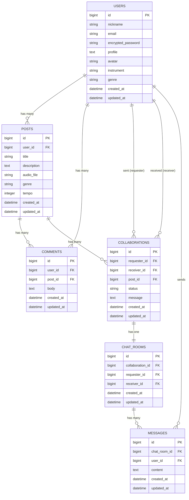

# 🎵 CollabTune（コラボチューン）

## 🧩 アプリ概要
DTMer（デスクトップミュージシャン）同士が、気軽に音源を投稿・共有し、  
コメントやコラボ申請を通して曲作りでつながることができるWebアプリ。  
目的は「音楽制作を通じた孤独の解消」と「創作の協働化」。

---

## 👤 対象ユーザー
- 自宅で一人でDTM制作しているアマチュアミュージシャン  
- 楽器は得意だがボーカルやMIXなど他分野の協力者を探している人  
- コラボのきっかけが欲しい人  

---

## ⚙️ 機能一覧

| No | 機能名 | 概要 | 対応モデル | 備考 |
|----|---------|------|-------------|------|
| 1 | ユーザー登録 | ニックネーム、メール、パスワードで登録 | User | Devise使用 |
| 2 | ログイン/ログアウト | 認証機能 | User | Devise使用 |
| 3 | 投稿一覧表示 | 投稿をカード形式で一覧表示（音源ストリーミング対応） | Post | トップページ（root） |
| 4 | 投稿作成 | タイトル、説明、音源ファイル、ジャンル、テンポを登録 | Post | ActiveStorageで音源添付 |
| 5 | 投稿詳細 | 音源詳細を表示し、コメント・コラボ申請ができる | Post, Comment, Collaboration | コメントは同ページ内 |
| 6 | コメント投稿 | 投稿詳細ページからコメントを送信 | Comment | 非同期（Turbo）実装予定 |
| 7 | コラボ申請 | コラボ希望メッセージを送信 | Collaboration | モーダルまたは別ページ |
| 8 | 投稿削除 | 自分の投稿を削除可能 | Post | 投稿者のみ操作可 |
| 9 | いいね機能（後日追加予定） | 投稿に対する共感を表現 | Like | 拡張予定機能 |

---

## 🖥 画面一覧と遷移

| 画面名 | 主な機能 | 遷移元 | 遷移先 |
|--------|-----------|--------|--------|
| トップページ | 投稿一覧表示、詳細ページへのリンク | 全ページ | 投稿詳細・ログイン・新規登録・投稿作成 |
| 新規登録ページ | アカウント作成 | トップ | トップ（登録後） |
| ログインページ | 認証 | トップ | トップ（ログイン後） |
| 投稿作成ページ | 新規投稿フォーム | トップ | トップ（投稿後） |
| 投稿詳細ページ | 投稿の再生・コメント・コラボ申請 | トップ | 同ページ内操作 |

---

## 🛠 使用技術

| 分野 | 使用技術 |
|------|-----------|
| フロントエンド | HTML / CSS / JavaScript / Turbo / TailwindCSS（予定） |
| バックエンド | Ruby on Rails 7 |
| 認証 | Devise |
| ファイル保存 | ActiveStorage（音源ファイル） |
| DB | MySQL（開発） / PostgreSQL（本番） |
| デプロイ | Render |
| バージョン管理 | GitHub |

---

## ER図

> ※VSCodeのMarkdownプレビュー（`⌘ + Shift + V`）で図が表示されます。


## 画面遷移図
```mermaid
graph TD
  A[トップページ<br>（投稿一覧・再生可能）] --> B[新規登録ページ]
  A --> C[ログインページ]
  A --> D[投稿詳細ページ]
  A --> E[投稿作成ページ]
  A --> H[コラボ一覧ページ<br>（自分の申請・受信状況）]

  D --> F[コメント投稿<br>（同ページ内）]
  D --> G[コラボ申請<br>（モーダルまたは別ページ）]

  B --> A
  C --> A
  E --> A
  G --> H
  H --> D

  ```
## 🚀 今後の拡張予定

- フォロー機能（他ユーザーの活動を追える）

- プロフィールページ（得意分野・機材紹介など）

- AIによる音楽ジャンルタグ自動付与（将来的な構想）